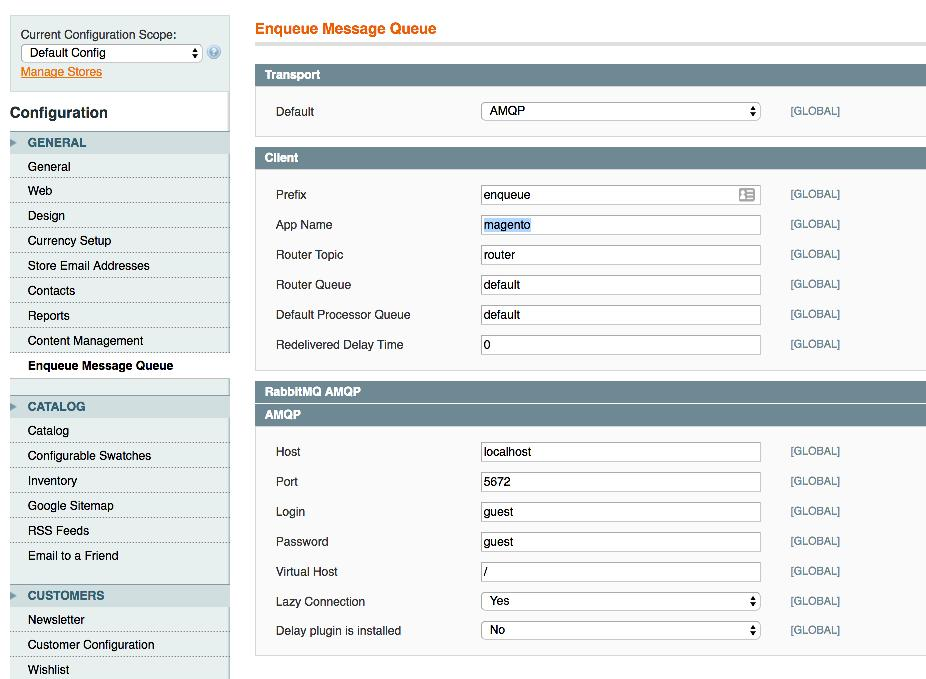

# Magento Enqueue. Quick tour

## Installation

We use [composer](https://getcomposer.org/) and [cotya/magento-composer-installer](https://github.com/Cotya/magento-composer-installer) plugin to install [magento-enqueue](https://github.com/php-enqueue/magento-enqueue) extension.

To install libraries run the commands in the application root directory.

```bash
composer require "magento-hackathon/magento-composer-installer:~3.0"
composer require "enqueue/magento-enqueue:*@dev" "enqueue/amqp-ext"
```

## Configuration

At this stage we have configure the Enqueue extension in Magento backend. 
The config is here: System -> Configuration -> Enqueue Message Queue.
Here's the example of Amqp transport that connects to RabbitMQ broker on localhost:
 



## Publish Message

To send a message you have to take enqueue helper and call `send` method.

```php
<?php

Mage::helper('enqueue')->send('a_topic', 'aMessage');
```

## Message Consumption

I assume you have `acme` Magento module properly created, configured and registered. 
To consume messages you have to define a processor class first: 

```php
<?php
// app/code/local/Acme/Module/Helper/Async/Foo.php

use Enqueue\Psr\PsrContext;
use Enqueue\Psr\PsrMessage;
use Enqueue\Psr\PsrProcessor;

class Acme_Module_Helper_Async_Foo implements PsrProcessor
{
    public function process(PsrMessage $message, PsrContext $context)
    {
        // do job
        // $message->getBody() -> 'payload'

        return self::ACK;         // acknowledge message
        // return self::REJECT;   // reject message
        // return self::REQUEUE;  // requeue message
    }
}
```

than subscribe it to a topic or several topics:


```xml
<!-- app/etc/local.xml -->

<config>
  <default>
    <enqueue>
      <processors>
        <foo-processor>
          <topic>a_topic</topic>
          <helper>acme/async_foo</helper>
        </foo-processor>
      </processors>
    </enqueue>
  </default>
</config>
```

and run message consume command:

```bash
$ php shell/enqueue.php enqueue:consume -vvv --setup-broker
```

[back to index](../index.md)
